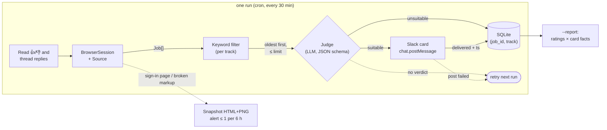

# jobscout

[](https://github.com/knmgn/jobscout/actions/workflows/ci.yml)


**A scheduled job-listing scout: a real browser reads the feeds, a keyword
pass narrows them, an LLM judges each one against a per-track rubric, and the
survivors land in Slack, where 👍 / 👎 reactions come back as tuning data.**


*A real card from `make demo`. The listing is invented; the judgement and
draft come from the LLM.*

## How it works



- **Source** knows one site: its URLs, selectors, sign-in redirect and
  wording. Everything downstream sees only a `Job`.
- **Tracks** in [`tracks.toml`](tracks.toml) say what to read, which
  keywords to keep, how to judge, and how much to spend per run.
- **State** is SQLite. A listing counts as processed only once it has a
  verdict and, if it was suitable, has been delivered.

## Quickstart

No accounts or API keys needed:

```sh
make install     # venv, package, Playwright's Chromium, git hooks
make demo        # starts the demo board, runs both tracks against it
```

`make demo` starts a local board of invented listings, reads it with
Chromium (pressing "Load more" as needed), filters and judges each track, and
prints the result:

```
[quick] ok: 8 candidate(s), judged 8, sent 5, to retry 0
[fit] ok: 8 candidate(s), judged 6, sent 2, to retry 0
No Slack credentials set: payloads are in out/slack/
```

Each file in `out/slack/` is a Block Kit payload; paste its `blocks` into
[Block Kit Builder](https://app.slack.com/block-kit-builder) to see the card.

Add credentials to `.env` (see [`.env.example`](.env.example)) and the same
command uses them:

| Set                                   | Effect                                           |
| ------------------------------------- | ------------------------------------------------ |
| nothing                               | deterministic stub judge; cards written to `out/slack/` |
| `OPENAI_API_KEY`                      | real LLM judgement                               |
| `SLACK_BOT_TOKEN` + `SLACK_CHANNEL_ID` | cards posted; reactions read back for `--report` |
| `SLACK_WEBHOOK_URL`                   | cards posted, no feedback loop                   |

The bot needs `chat:write` and `channels:history` (`groups:history` for a
private channel), and has to be invited to the channel.

Other things to try:

```sh
.venv/bin/python -m jobscout --demo --dump           # candidates per track, no LLM
.venv/bin/python -m jobscout --demo expired          # the expired-session alert path
.venv/bin/python -m jobscout --demo --report         # after reacting to some cards
make board                                           # browse the board at :8765
make test                                            # unit + browser tests
```

## Design decisions

Each of these came from running the original tool for real. The reasoning
is in [docs/design.md](docs/design.md).

- **[Two tracks, one pass](docs/design.md#two-tracks-one-pass)**: quick wins
  and strategic fit differ in feed, query and rubric, not in code.
- **[Keyed by (job_id, track)](docs/design.md#keyed-by-job_id-track)**: one
  track's rejection never hides a listing from the other.
- **[Processed only after success](docs/design.md#mark-processed-only-after-success)**:
  a failed LLM call or Slack post is retried next run, not lost.
- **[Throttled failure alerts](docs/design.md#throttled-failure-alerts)**:
  at most once per 6 hours per track, because a silent channel is ambiguous
  and a noisy one gets muted.
- **[Snapshot on failure](docs/design.md#snapshot-on-failure)**: the HTML is
  saved, and `--parse-file` replays it offline while the selectors are fixed.
- **[Keywords filtered locally](docs/design.md#keywords-are-filtered-on-our-side)**:
  whole-word matching in front of the LLM; `limit` caps the cost of each run.
- **[The rubric is config](docs/design.md#the-rubric-is-config)**: the
  system prompt stays fixed; what a track wants lives in `tracks.toml`.
- **[Structured output](docs/design.md#structured-llm-output)**: an
  off-schema reply is "no verdict, retry", never a quiet `false`.
- **[The feedback loop](docs/design.md#the-feedback-loop)**: reactions and
  thread replies are grouped by card facts, to show which pre-filter would
  have saved LLM calls.
- **[No evasion](docs/design.md#what-the-browser-does-not-do)**: when a site
  stops serving the feed, the scout saves what it saw and asks for a person.

## Configuration

[`tracks.toml`](tracks.toml) holds the source and the tracks.

```toml
[source]
class = "jobscout.sources.demo:DemoSource"   # any Source subclass, "module:Class"
# profile_dir = ".browser-profile"           # keep a signed-in session between runs

[source.options]                             # passed to the class's constructor
base_url = "http://127.0.0.1:8765"

[[track]]
name = "quick"                 # used in the database, logs and file names
label = "Quick win"            # Slack card heading
emoji = "⚡"
feeds = ["newest"]             # feed names the source defines
query = '"google sheets" OR "python script" OR zapier'
max_jobs = 40                  # listings loaded per feed before filtering
limit = 8                      # listings judged per run (the LLM cost cap)
enabled = true
guidance = """
The rubric the LLM applies to this track.
"""
```

| Key        | Default  | Meaning                                                                 |
| ---------- | -------- | ----------------------------------------------------------------------- |
| `name`     | required | Unique id. Changing it starts the track's history afresh.               |
| `feeds`    | required | One or more feed names from the source; merged and de-duplicated.       |
| `guidance` | required | Appended to the fixed system prompt. The part to tune.                  |
| `query`    | `""`     | `"phrase" OR word ...`, whole-word and case-insensitive. Empty keeps all. |
| `max_jobs` | `30`     | How far to grow each feed ("Load more") before filtering.               |
| `limit`    | `8`      | Listings judged per run, failed attempts included. `--limit` overrides it. |
| `label`, `emoji` | name, none | Shown on the Slack card.                                      |
| `enabled`  | `true`   | Disabled tracks run only when named with `--track`.                     |

Unknown keys are kept and shown by `--list-tracks`, so a typo is visible
rather than silently ignored.

Environment variables (or `.env`): `OPENAI_API_KEY`, `OPENAI_MODEL`
(default `gpt-4o-mini`), `SLACK_BOT_TOKEN`, `SLACK_CHANNEL_ID`,
`SLACK_WEBHOOK_URL`, `JOBSCOUT_CONFIG`. Command-line flags are listed by
`python -m jobscout --help`; the one-off modes are described in
[docs/design.md](docs/design.md#one-off-modes).

Running on a schedule is a single crontab line:

```cron
*/30 * * * * cd /path/to/jobscout && .venv/bin/python -m jobscout >> jobscout.log 2>&1
```

Run `--seed` once first, so the first scheduled run does not post the whole
backlog.

## Writing a source for a real site

A source is one class that answers four questions about a site. The whole
interface is in [`sources/base.py`](src/jobscout/sources/base.py), and
[`sources/demo.py`](src/jobscout/sources/demo.py) is a complete example to
copy.

```python
class MySource(Source):
    name = "mysite"
    feeds = ("newest", "recommended")  # names tracks.toml can use

    def feed_url(self, feed: str) -> str:
        """Where a feed lives."""

    def page_state(self, page: Page) -> PageState:
        """OK, SESSION_EXPIRED or UNEXPECTED, from the URL and the DOM."""

    def expand(self, page: Page, want: int) -> int:
        """Grow the feed to `want` listings; press_load_more() covers the button case."""

    def parse(self, html: str, now: datetime | None = None) -> list[Job]:
        """HTML in, Job list out. No browser, so it can be tested on saved pages."""
```

A workable order:

1. Point `[source] class` at your module, set `profile_dir`, and sign in once
   by hand in that profile (a headed run: `--headed --snapshot`).
2. Run `--snapshot` and write `parse` against the saved HTML with
   `--parse-file` until every card comes out right. Put a trimmed, **invented**
   copy of the markup in your tests rather than a real page.
3. Write `page_state` so a sign-in page is recognised as `SESSION_EXPIRED`.
   That is what turns an expired login into an alert instead of silence.
4. Map the site's card facts onto the keys in
   [`models.FACT_LABELS`](src/jobscout/models.py), and turn relative dates
   into `posted_at`.

Keep to the site's terms of service. Read at a modest interval, from your own
signed-in session. If the site challenges or blocks the browser, the right
response is the one built in: stop and let a person look.

## Limitations

- **Sessions are renewed by a person.** An expired sign-in is detected,
  snapshotted and alerted on, and that is all. By design, nothing tries to
  sign back in or get past a challenge.
- **One source per run.** Tracks can read different feeds, but from the same
  site. Two sites means two configs and two cron lines.
- **The keyword filter is simple.** `OR` only, no `AND`/`NOT`, and matching is
  on whole words. It is a cost filter, not search.
- **Feedback is 👍 / 👎 only**, read by polling the last 14 days of channel
  history. Older reactions are not picked up.
- **Only OpenAI is implemented as a judge.** The `Judge` protocol is one
  method, so another provider is a small class.
- **The report suggests; it does not act.** Turning a pattern in `--report`
  into a pre-filter is left to a person, on purpose.
- **Single machine.** State is a local SQLite file; nothing coordinates two
  instances running at once.

## License

[MIT](LICENSE)
